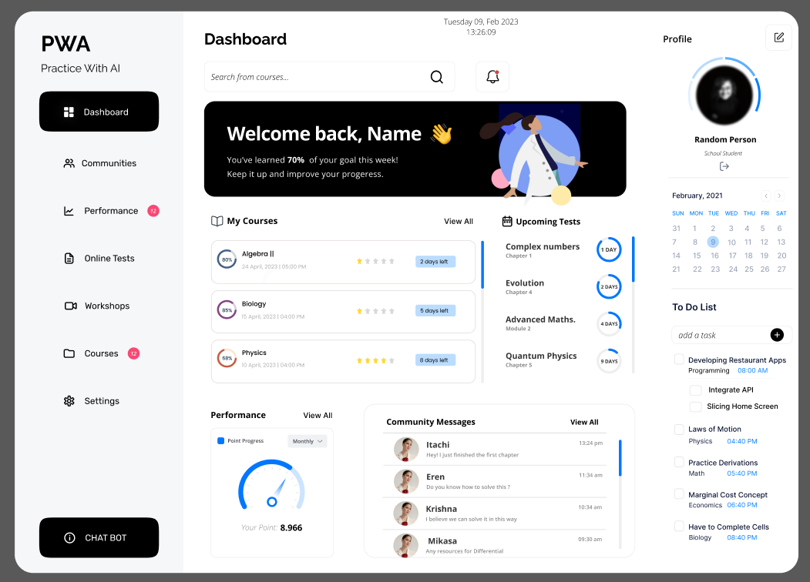
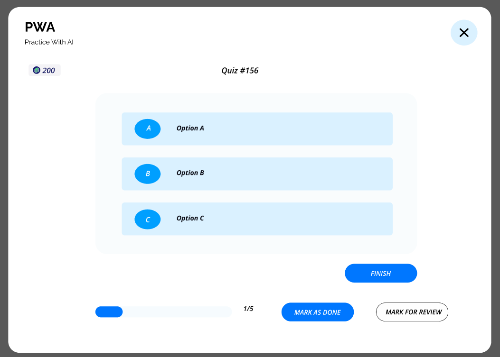

# AI Quiz Practice App Design 🎨🤖

Welcome to the **AI Quiz Practice App Design** repository! This project contains a Figma design for a Windows-based quiz practice program with an intuitive AI-powered interface.  

## 🌟 Features
- 🖌️ **Modern Design**: Sleek and user-friendly interface for an engaging experience.
- 🤖 **AI Integration**: Conceptualized for smart, interactive quiz assistance.
- 🎯 **Customizable Layouts**: Designed for flexibility in quiz topics and modes.
- 📊 **Dashboard UI**: Tracks user progress and displays insights.

## 📂 Screens

## 📜 License
This design is licensed under the MIT License. Please provide attribution if you use it in your projects.  

## 🤝 Contributing
Feedback and contributions to improve the design are welcome! Feel free to open an issue or submit suggestions.  
